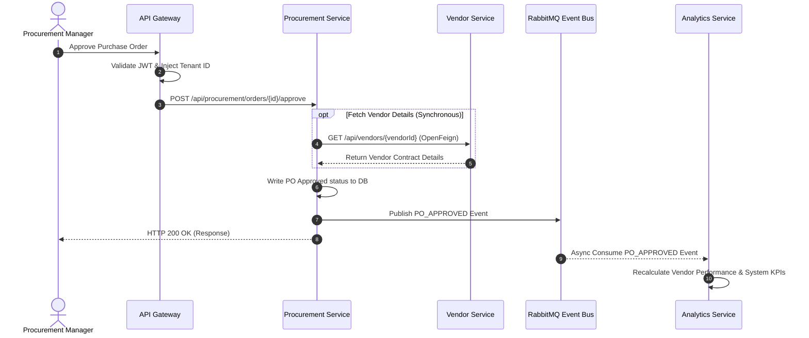

# ProcureX – High-Level Design (HLD)

This document provides a bird's-eye view of the **ProcureX** enterprise e-procurement system. It defines the architectural goals, major components, system workflows, and structural design pattern of the application. It serves as a guide for system architects, developers, and stakeholders to understand how the entire system is organized and operates.

---

## 1. Introduction

### Purpose
The purpose of this High-Level Design (HLD) document is to establish the blueprint for **ProcureX**, a multi-tenant enterprise B2B SaaS e-procurement platform. This document outlines the overall system topology, subsystem boundaries, data flows, and technical objectives.

### Scope
This design covers:
- The React frontend application structure.
- The Microservices ecosystem (API Gateway, Identity Service, Vendor, Procurement, Inventory, Finance, Notification, and Analytics).
- Asynchronous communication via RabbitMQ.
- Service discovery and registry using Eureka.
- External SMTP integrations and future third-party integrations (Payment gateways, ERPs, Cloud storage).

### Objectives
- Define a modular, service-oriented system layout.
- Decouple distinct business domains (e.g., Procurement from Finance) to support independent scaling.
- Ensure strict tenant data isolation.
- Standardize high-level integration patterns (Sync Feign/REST clients and Async Events).

### Assumptions and Constraints

#### Assumptions
- **Single Tenant Organization in V1:** Although the system is architected for multi-tenancy, Phase 1 assumes active deployment targets one host tenant organization.
- **Asynchronous Reliability:** RabbitMQ is assumed to be highly available and clustered within the deployment environment to prevent message loss.
- **Trusted Private Network:** Internal microservice communication via REST/OpenFeign occurs inside a secure, trusted virtual private cloud (VPC) network.
- **UTC Timezone:** All microservice databases and system clocks use UTC timestamps for consistent audit logging.

#### Constraints
- **No Distributed Transactions:** The system must not use 2-Phase Commit (2PC) or distributed lock-heavy transactions to prevent performance bottlenecks.
- **Database-per-Service:** No service is permitted to query or modify a database owned by another service.
- **Strict Sync Patterns:** Synchronous communication is restricted to OpenFeign REST clients only.
- **Relational Storage:** MySQL is the mandatory persistence layer for transactional services.
- **JWT-only Auth:** The system relies strictly on stateless JWT validation at the Gateway.

---

## 2. Design Goals

To support enterprise-level operations, ProcureX is built around four core design principles:

### Scalability
- **Horizontal Scaling:** All microservices are stateless, allowing multiple replicas to run behind the API Gateway.
- **Database Isolation:** By implementing the *Database-per-Service* pattern, data stores can be scaled independently or upgraded to different database engines if needed.

### Availability
- **Fault Isolation:** Failure in non-critical components (such as Notifications or Analytics) does not disrupt core workflows like RFQ submissions or Purchase Requisitions.
- **Service Registry:** Eureka dynamically monitors service instances, automatically deregistering unhealthy instances.

### Security
- **Zero-Trust Downstream:** The API Gateway validates incoming JWT signatures and propagates verified identities via headers, ensuring downstream services don't handle raw validation details.
- **Logical Tenant Isolation:** Strict tenant context propagation ensures that organization data remains segregated.

### Maintainability
- **Clean Boundaries:** Domains are isolated by bounded contexts, reducing code churn and enabling small, focused teams to own individual services.

---

## 3. Architecture Principles

ProcureX adheres to a strict set of architectural principles to guide ongoing development:
- **Single Responsibility per Service:** Each microservice owns one bounded business domain (e.g., Finance handles only ledger/invoices, Procurement handles bids/orders).
- **Database per Service:** Decoupled persistence ensures data store isolation.
- **API First Design:** Service contracts (Swagger/OpenAPI) are established before code implementation.
- **Event-Driven Communication:** Asynchronous RabbitMQ events drive downstream updates (Notifications, Analytics) to prevent service coupling.
- **Loose Coupling & High Cohesion:** Minimizing synchronous inter-service dependencies while keeping related logic localized within its respective domain.
- **Stateless Services:** All application servers maintain no session state, facilitating container orchestration (e.g., Kubernetes).
- **Fail Fast:** Input validation, circuit breakers, and network timeouts reject invalid states or slow connections early.
- **Domain-Driven Boundaries:** Boundaries are designed using Domain-Driven Design (DDD) aggregates and subdomains.

---

## 4. Architectural Overview

ProcureX is designed as a **Microservices-based SaaS platform**. It routes client traffic through a secure API Gateway, which handles security token checks and dynamically forwards requests to registered microservices. 

Services use synchronous REST calls for real-time reads and validation checks, while utilizing an asynchronous event bus (RabbitMQ) to trigger downstream workflows, run analytics pipeline computations, and send notifications.

---

## 5. High-Level Architecture Diagram

The diagram below illustrates the end-to-end topology of the ProcureX system:

```mermaid
graph TD
    %% Define styles
    classDef client fill:#f9f,stroke:#333,stroke-width:2px;
    classDef gateway fill:#bbf,stroke:#333,stroke-width:2px;
    classDef service fill:#bfb,stroke:#333,stroke-width:2px;
    classDef broker fill:#fdb,stroke:#333,stroke-width:2px;
    classDef db fill:#ddd,stroke:#333,stroke-width:2px;

    %% Elements
    Users((End Users)) ::: client
    FE[React Frontend] ::: client
    GW[API Gateway] ::: gateway
    Eureka[Eureka Server] ::: gateway
    
    subgraph Microservices ["Microservices Layer (Spring Boot)"]
        Identity[Identity Service] ::: service
        Vendor[Vendor & Catalog] ::: service
        Procurement[Procurement Service] ::: service
        Inventory[Inventory Service] ::: service
        Finance[Finance Service] ::: service
        Notification[Notification Service] ::: service
        Analytics[Reporting & Analytics] ::: service
    end

    subgraph Storage ["Databases Layer (MySQL)"]
        db_id[(Identity DB)] ::: db
        db_ven[(Vendor DB)] ::: db
        db_pro[(Procurement DB)] ::: db
        db_inv[(Inventory DB)] ::: db
        db_fin[(Finance DB)] ::: db
        db_not[(Notification DB)] ::: db
        db_anl[(Analytics DB)] ::: db
    end

    MQ{RabbitMQ Exchange} ::: broker

    %% Relations
    Users --> FE
    FE -->|HTTP / JWT| GW
    GW -.->|Lookup| Eureka
    
    GW --> Identity
    GW --> Vendor
    GW --> Procurement
    GW --> Inventory
    GW --> Finance
    GW --> Notification
    GW --> Analytics

    %% DB Connections
    Identity --> db_id
    Vendor --> db_ven
    Procurement --> db_pro
    Inventory --> db_inv
    Finance --> db_fin
    Notification --> db_not
    Analytics --> db_anl

    %% RabbitMQ Pub/Sub
    Procurement -.->|Publish events| MQ
    Finance -.->|Publish events| MQ
    Inventory -.->|Publish events| MQ
    Vendor -.->|Publish events| MQ
    Identity -.->|Publish events| MQ
    
    MQ -.->|Consume events| Notification
    MQ -.->|Consume events| Analytics
    MQ -.->|Consume events| Procurement
    MQ -.->|Consume events| Finance
    MQ -.->|Consume events| Inventory
```

---

## 6. Major Components

| Component | Responsibility | Technical Stack |
|-----------|----------------|-----------------|
| **Frontend** | Renders dashboards for Admin, Procurement, Inventory, Finance, and Vendors. | React, Vite, Tailwind CSS |
| **API Gateway** | Directs requests, performs JWT verification, injects tenant claims downstream. | Spring Cloud Gateway |
| **Eureka** | Registers service instances and resolves service lookup dynamics. | Spring Cloud Netflix Eureka |
| **RabbitMQ** | Asynchronous event broker handling message distribution between services. | RabbitMQ |
| **Identity Service** | Manages user credentials, authentication, permissions, and audit logs. | Spring Boot, Spring Security, JWT |
| **Vendor & Catalog** | Handles vendor corporate profiles, contract records, and item master catalogs. | Spring Boot, JPA |
| **Procurement Service** | Manages Requisitions, RFQs, Quotation comparison, and Purchase Orders. | Spring Boot, JPA |
| **Inventory Service** | Tracks stock items, schedules warehouses, handles GRNs and Inspections. | Spring Boot, JPA |
| **Finance Service** | Runs three-way PO-GRN-Invoice matches, processes budgets and payments. | Spring Boot, JPA |
| **Notification Service** | Sends in-app push messages and emails template updates. | Spring Boot, Spring Mail, SMTP |
| **Reporting & Analytics** | Pre-aggregates vendor scorecards, financial reports, and metrics counters. | Spring Boot, JPA |

---

## 7. Business Workflow

The central business lifecycle of ProcureX spans from vendor onboarding to payment fulfillment:

```mermaid
graph TD
    classDef step fill:#e1f5fe,stroke:#03a9f4,stroke-width:2px;
    classDef success fill:#e8f5e9,stroke:#4caf50,stroke-width:2px;

    V_REG[1. Vendor Registration] ::: step --> V_APP[2. Registration Approval] ::: step
    V_APP --> PR_CRE[3. Purchase Requisition Created] ::: step
    PR_CRE --> RFQ_CRE[4. RFQ Created & Published] ::: step
    RFQ_CRE --> BID_SUB[5. Quotations / Bids Submitted] ::: step
    BID_SUB --> BID_COM[6. Quotation Comparison & Award] ::: step
    BID_COM --> PO_APP[7. Purchase Order Approval] ::: step
    PO_APP --> GRN_REC[8. Goods Receipt Note & QC] ::: step
    GRN_REC --> INV_MAT[9. Invoice Upload & Three-Way Match] ::: step
    INV_MAT --> PAY_INIT[10. Payment Disbursed & Completed] ::: success
```

---

## 8. Component Diagram

The following diagram illustrates how the frontend connects to microservices and how those microservices depend on internal and external backing components:

```mermaid
graph LR
    classDef react fill:#61dafb,stroke:#333;
    classDef gw fill:#81c784,stroke:#333;
    classDef core fill:#ffb74d,stroke:#333;
    classDef back fill:#e0e0e0,stroke:#333;

    FE[React App] ::: react -->|REST| GW[API Gateway] ::: gw
    
    subgraph Microservices ["Independent Domain Core"]
        Identity[Identity Service] ::: core
        Vendor[Vendor Service] ::: core
        Procurement[Procurement Service] ::: core
        Inventory[Inventory Service] ::: core
        Finance[Finance Service] ::: core
    end

    GW --> Identity
    GW --> Vendor
    GW --> Procurement
    GW --> Inventory
    GW --> Finance

    Identity -.->|Auth Logs| AuditLogs[(Audit Database)] ::: back
    Procurement -->|Feign Client| Vendor
    Finance -->|Feign Client| Procurement
    Inventory -->|Feign Client| Procurement
```

---

## 9. Data Flow

Data moves dynamically across services using two primary paradigms: synchronous queries and asynchronous events:



---

## 10. Communication Flow

ProcureX distinguishes inter-service communication types to guarantee reliability:

### Synchronous (REST via OpenFeign)
- Used when a transaction is dependent on the return data of another domain.
- Requires instant validation (e.g. checking whether a vendor contract is valid before raising an RFQ).
- Tokens are automatically propagated down through Feign Request Interceptors.

### Asynchronous (RabbitMQ Events)
- Decouples domains for high throughput.
- Updates background services (Analytics, Notifications) without blocking primary flows.
- Implements the **Transactional Outbox Pattern** to ensure events are recorded locally and sent even if the message broker is temporarily offline.

---

## 11. External Systems

```mermaid
graph TD
    classDef system fill:#eceff1,stroke:#607d8b,stroke-width:2px;
    classDef ext fill:#fff9c4,stroke:#fbc02d,stroke-width:2px;

    Core[ProcureX Microservices] ::: system
    SMTP[Email Service SMTP] ::: ext
    PGW[Future Payment Gateway] ::: ext
    ERP[Future ERP SAP/Oracle] ::: ext
    Cloud[Future Cloud Storage S3] ::: ext

    Core -->|Asynchronous SMTP| SMTP
    Core -.->|Future REST Integrations| PGW
    Core -.->|Future REST Integrations| ERP
    Core -.->|Future SDK / S3 API| Cloud
```

- **SMTP Email:** Triggers alerts for bid invitations, approvals, and order notifications.
- **Future Payment Gateway:** Direct webhook integration to reconcile cash transfers.
- **Future ERP System Integration:** Exposes transactional tables to downstream ERP databases.
- **Future Cloud Storage:** Storing inspection attachments, invoice PDFs, and vendor catalog uploads.

---

## 12. Security Overview

Security is enforced at multiple boundaries:
1. **At the Gateway:** Verifies JWT token signatures using cached public keys (JWKs) and drops unauthorized incoming connections.
2. **Identity Headers:** Injects headers like `X-User-Id`, `X-User-Roles`, and `X-Organization-Id` to keep downstream calls stateless and role-aware.
3. **Password Security:** Credentials are salted and hashed using BCrypt prior to storage.
4. **Logical Multi-Tenancy:** Global tenant isolation is implemented at the database tier using Hibernate filter queries, ensuring organization data never leaks.

---

## 13. Deployment Overview

The following layout illustrates the runtime traffic path from client request to database retrieval:

```mermaid
graph TD
    classDef web fill:#e3f2fd,stroke:#2196f3,stroke-width:2px;
    classDef secure fill:#ffebee,stroke:#f44336,stroke-width:2px;
    classDef backend fill:#f5f5f5,stroke:#9e9e9e,stroke-width:2px;

    Client[Browser Client] ::: web -->|HTTPS Request| GW[API Gateway] ::: secure
    GW -->|Validate and Route| Svc[Stateless Microservice Replication Instance] ::: backend
    Svc -->|Local Queries| DB[(MySQL Local DB)] ::: backend
    Svc -.->|Post Event| Broker[RabbitMQ Broker] ::: secure
```

---

## 14. High-Level Design Decisions

1. **Microservices over Monolith:** Scalability demands and domain decoupling (such as Vendor management vs. Financial Audits) justified a service-oriented approach.
2. **Database-per-Service:** Mitigates risk of cross-domain database coupling, making it possible to modify internal schemas without affecting other teams.
3. **Choreographed Saga over Orchestration:** A decentralized choreography saga style was adopted for transactional flows (e.g. PO Budget Reservation), preventing a single orchestrator service from becoming a bottleneck.
4. **RabbitMQ over Kafka:** ProcureX processes point-to-point business workflow events and routing patterns rather than high-throughput log streaming, making RabbitMQ the ideal lightweight AMQP broker.
