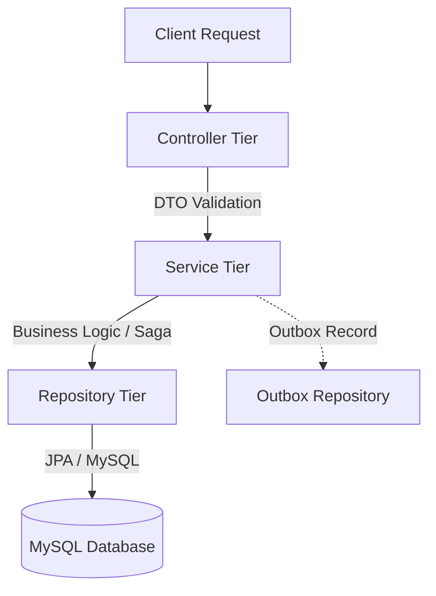
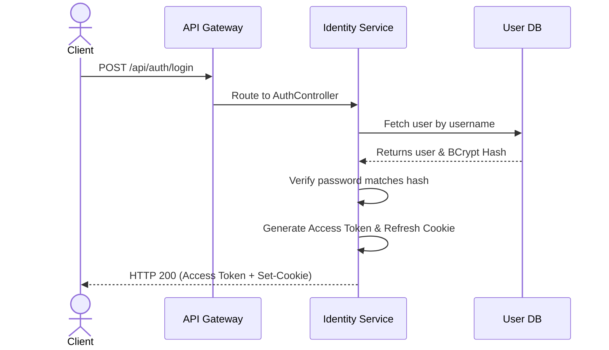
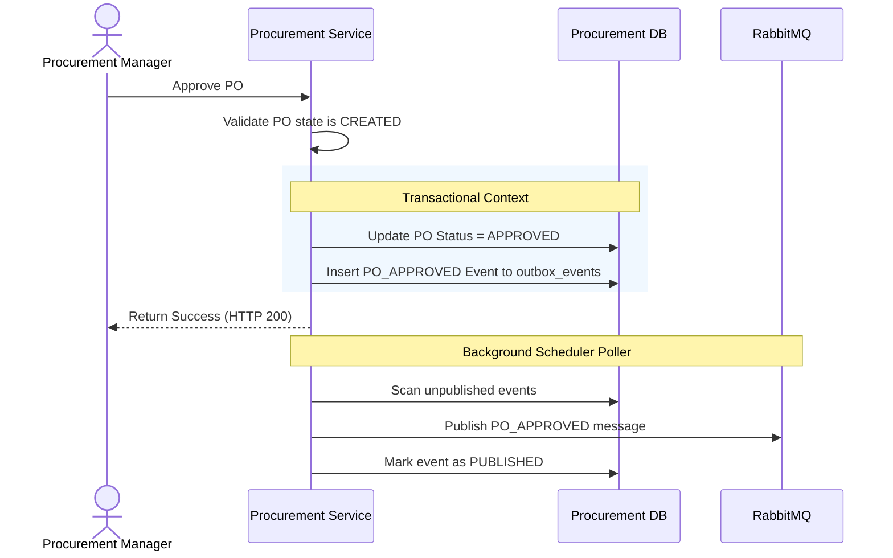

# ProcureX – Low-Level Design (LLD)

This document provides the Low-Level Design (LLD) specification for **ProcureX**. It acts as a detailed blueprint for developers, translating architectural guidelines into concrete classes, interfaces, method signatures, transaction boundaries, and sequence diagrams.

---

## 1. Introduction

### Purpose
The LLD specifies the implementation detail of each microservice in ProcureX. It establishes common patterns (layered architecture, error handling, validation) and lists the design elements (Entities, DTOs, Controllers, Services, and Repositories) for all 7 services.

### Scope
This document covers the Spring Boot application design, mapping of entity-to-schema relationships (cross-referencing [05_Database_Design.md](file:///c:/Users/DELL/Desktop/Projects/ProcureX/ProcureX/05_Database_Design.md)), validation rules, transactional limits, event bindings, and class/sequence interactions.

---

## 2. Common Design Patterns

To maintain code consistency across the engineering team, all Spring Boot microservices adhere to standard patterns:

### 2.1 Layered Architecture
Each service is split into four logical tiers:
1. **Controller Layer (`@RestController`):** Exposes HTTP REST endpoints, performs basic request validation, and handles HTTP response mapping.
2. **Service Layer (`@Service`):** Orchestrates business logic, manages transactions (`@Transactional`), and publishes events.
3. **Repository Layer (`@Repository`):** Executes queries using Spring Data JPA.
4. **Database Layer:** Logical schema isolated per microservice.



### 2.2 Standard Package Structure
```text
com.procurex.[service_name]/
├── config/             # Spring Configurations (Security, RabbitMQ, WebMvc)
├── controller/         # REST Controllers
├── service/            # Interfaces and implementation classes
├── repository/         # Spring Data JPA repositories
├── entity/             # JPA Entities (Hibernate mappings)
├── dto/                # Request & Response Data Transfer Objects (Records)
├── exception/          # Custom Exceptions & Global Exception Handler
└── event/              # Event listeners and outbox pollers
```

### 2.3 Data Transfer Object (DTO) Pattern
- **Records:** Input payloads and responses are modeled as immutable Java `record` types to prevent state mutations.
- **Mappers:** ModelMapper or MapStruct is used to isolate domain entities from public API schemas.
- **Example:**
  ```java
  public record CreateRequisitionRequest(
      @NotNull String title,
      @NotEmpty List<RequisitionItemDto> items,
      @DecimalMin("0.01") BigDecimal estimatedBudget
  ) {}
  ```

### 2.4 Centralized Exception Handling
A global controller advice handles standard exceptions and maps them to JSON error formats:
- `@RestControllerAdvice` captures:
  - `MethodArgumentNotValidException` ➔ `400 Bad Request` (with fields validation errors)
  - `EntityNotFoundException` ➔ `404 Not Found`
  - `IllegalArgumentException` / `IllegalStateException` ➔ `400 Bad Request`
  - `AccessDeniedException` ➔ `403 Forbidden`
  - All unhandled exceptions ➔ `500 Internal Server Error`

### 2.5 Validation
- **Request Validation:** Declared on Controller endpoints using `@Valid`.
- **Fields Validation:** Leverages standard JSR-380 annotations (e.g. `@NotBlank`, `@Size`, `@Pattern`, `@Min`).

### 2.6 Logging & Security
- **SLF4J / Logback:** Centralized logging format with JSON encoder for log collectors.
- **Context Injection:** Interceptors extract the downstream headers (`X-User-Id`, `X-User-Roles`, `X-Organization-Id`) from the Gateway, injecting them into Spring Security's `SecurityContext`.

---

## 3. Identity Service

### Overview
Manages authentication, token generation, user profiles, role mappings, and audit trail aggregation.

### Key Entities
- **User:** Maps to `users` table. (See [05_Database_Design.md: L12-L45](file:///c:/Users/DELL/Desktop/Projects/ProcureX/ProcureX/05_Database_Design.md#L12-L45)). Represents accounts.
- **Role:** Maps to `roles` table. Represent access categories.
- **AuditLog:** Maps to `audit_logs` table. Stores write-operations.

### Controllers, Services, & Repositories
- **AuthController:** Exposes `/api/auth/login`, `/api/auth/refresh`, `/api/auth/logout`.
- **UserController:** Exposes `/api/users/**` for administration.
- **AuthService:** Validates credentials, issues JWT access tokens, rotates refresh tokens.
- **UserRepository:** `findByUsernameIgnoreCase()`, `findByOrganizationId()`.

### Validation & Business Rules
- Passwords must be hashed using BCrypt (strength 12) before persistence.
- Access tokens expire in 15 minutes; refresh tokens expire in 7 days (HttpOnly cookies).
- Accounts lock automatically after 5 consecutive failed login attempts.

### Sequence Diagram: Authentication & Claim Propagation


---

## 4. Vendor & Catalog Service

### Overview
Manages external vendor profiles, contract terms, product master catalog, and mapping vendor pricing.

### Key Entities
- **Vendor:** Maps to `vendors` table (profile state).
- **Product:** Maps to `products` table (organization product master).
- **VendorProductMapping:** Maps to `vendor_products` table (pricing, lead times).
- **Contract:** Maps to `contracts` table (agreements).

### Controllers, Services, & Repositories
- **VendorController:** Handles profiles and onboarding stages.
- **CatalogController:** Handles product registrations.
- **VendorService:** Processes registration approvals and checks compliance.
- **CatalogService:** Manages master directories.

### Validation & Business Rules
- An active Vendor must map to a User in the Identity Service (with role `VENDOR`).
- Product Minimum Order Quantity (MOQ) must be greater than or equal to 1.
- Contract statuses transition: `DRAFT` ➔ `ACTIVE` ➔ `EXPIRED` / `TERMINATED`.

---

## 5. Procurement Service

### Overview
Handles the core workflows: Purchase Requisition (PR), Request for Quotation (RFQ), bidding, bid comparison, and Purchase Order (PO) creation.

### Key Entities
- **PurchaseRequisition:** Maps to `purchase_requisitions`.
- **RequestForQuotation:** Maps to `rfqs`.
- **Quotation:** Maps to `quotations` (vendor bids).
- **PurchaseOrder:** Maps to `purchase_orders`.

### Controllers, Services, & Repositories
- **RequisitionController:** Handles creation and internal manager approval workflows.
- **RFQController:** Publishes bids.
- **QuotationController:** Exposes endpoints for vendors to submit quotes.
- **PurchaseOrderService:** Manages PO approval states, budget validations, and outbox creation.

### Validation & Business Rules
- PRs must have an estimated budget greater than $0.
- Quotations cannot be submitted after the RFQ closing date.
- PO lifecycle transitions: `CREATED` ➔ `APPROVED` ➔ `SENT_TO_VENDOR` ➔ `ACCEPTED_BY_VENDOR` ➔ `CLOSED`.

### Sequence Diagram: Purchase Order Approval & Outbox Publishing


---

## 6. Inventory Service

### Overview
Manages physical warehouses, tracks stock items, processes incoming shipments (GRN), Quality Control (QC), and returns.

### Key Entities
- **Warehouse:** Maps to `warehouses` table.
- **StockLevel:** Maps to `stock_levels` table.
- **GoodsReceiptNote:** Maps to `goods_receipt_notes` table.
- **QualityInspection:** Maps to `quality_inspections` table.
- **StockTransaction:** Maps to `stock_transactions` table (immutable audit ledger).

### Controllers, Services, & Repositories
- **GRNController:** Processes incoming shipments.
- **InspectionController:** Logs quality audits.
- **InventoryService:** Adjusts stock levels and records immutable ledger entries.

### Validation & Business Rules
- GRN quantities cannot exceed the remaining pending quantities approved in the original Purchase Order.
- Stock transactions must be logged with a transaction type (`INCOMING`, `OUTGOING`, `RESERVED`, `DAMAGED`) and are strictly append-only.
- Quality Inspections must yield an `ACCEPTED` status before items enter the active inventory.

---

## 7. Finance Service

### Overview
Manages department budgets, matches invoices (3-way PO-GRN-Invoice matching), and handles payment transactions.

### Key Entities
- **Budget:** Maps to `budgets` table.
- **Invoice:** Maps to `invoices` table.
- **PaymentTransaction:** Maps to `payment_transactions` table.

### Controllers, Services, & Repositories
- **InvoiceController:** Uploads and triggers verification.
- **BudgetController:** Sets up limits and tracks department allocations.
- **VerificationService:** Core logic matching Invoice quantity & cost against GRN accepted quantity and PO pricing.
- **PaymentService:** Integrates with payment processor adapters and posts payment states.

### Validation & Business Rules
- **Three-Way Match Verification:**
  $$\text{Invoice Qty} \le \text{GRN Accepted Qty}$$
  $$\text{Invoice Unit Price} = \text{PO Unit Price}$$
- Budget utilization checks must query local organization budget allocation before authorizing PO validation events.

---

## 8. Notification Service

### Overview
Fulfills messaging actions via SMTP email transmission or in-app channels.

### Key Entities
- **NotificationLog:** Maps to `notification_logs` table (delivery histories).
- **NotificationTemplate:** Maps to `notification_templates` (Thymeleaf template bindings).

### Core Components
- **RabbitMQ Listeners:** Bound to exchange routing keys (e.g. `*.approved`, `*.created`).
- **NotificationService:** Compiles template formats using context models and coordinates delivery adapters.

### Validation & Business Rules
- System errors must fail silently without blocking parent transactions in the publisher microservices.
- Email delivery must support fallback retries (up to 3 times) before logging a failure audit entry.

---

## 9. Reporting & Analytics Service

### Overview
Processes business operations events to construct real-time dashboards and calculate rating metrics.

### Key Entities
- **DashboardMetric:** Pre-aggregated statistical counts (e.g., total spend, PO cycles).
- **VendorRatingCard:** Stores calculated scorecards (quality ratio, on-time delivery ratio).

### Core Components
- **MetricsEventListener:** Consumes all business lifecycle messages asynchronously.
- **ScorecardScheduler:** Cron executor calculating vendor rankings.

### Validation & Business Rules
- Analytics recalculations operate on read-only tables to avoid locking core transactional tables.
- Vendor scores are mapped on a $0.0$ to $5.0$ scale based on quality and schedule performance:
  $$\text{Score} = (\text{On-Time Ratio} \times 0.6) + (\text{Quality Ratio} \times 0.4)$$

---

## 10. Design Decisions & Guidelines

1. **Transactional Outbox Scheduling:** A polling frequency of 1 second is configured for each service's outbox poller, balancing database load with message real-time delivery expectations.
2. **DTO Isolation:** Entity leakage directly to controllers is blocked. Mappers enforce boundary structures.
3. **No Database Joins Across Services:** REST communication using OpenFeign manages identity mappings, preserving schema decoupling.
