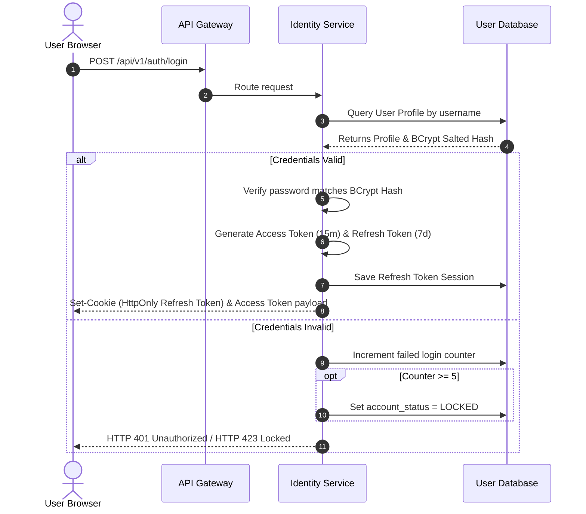

# ProcureX – Security Design Specification

This document details the security model, architectural boundaries, and defensive mitigations for **ProcureX**. It outlines how data and operations are secured across the frontend React client, API Gateway, microservices, and databases.

---

## 1. Introduction

### Purpose
The purpose of this Security Design specification is to establish a comprehensive framework for securing the multi-tenant ProcureX SaaS e-procurement platform. 

### Scope
This design spans all system layers: identity verification, inter-service context sharing, logical multi-tenancy, rate limiting, and web vulnerability mitigations.

### Security Objectives
- **Zero-Trust Backend Routing:** Enforce identity validation at the perimeter gateway.
- **Tenant Isolation:** Guarantee that organization data is completely isolated.
- **Secure Transactional Accountability:** Map immutable audit records to all mutations.

---

## 2. Security Goals

ProcureX is designed around the CIA triad and standard security goals:

- **Confidentiality:** Data in transit is encrypted using HTTPS (TLS 1.3), and passwords are encrypted using BCrypt.
- **Integrity:** Digital signatures (JWT) verify that incoming claim headers have not been tampered with.
- **Availability:** Rate-limiting filters block DDoS and brute-force traffic, protecting resource availability.
- **Authentication:** Verifies user identity using short-lived tokens and cryptographic session verification.
- **Authorization:** Restricts user operations using Role-Based Access Control (RBAC).
- **Accountability:** Captures user audits to trace critical workflow alterations.
- **Tenant Isolation:** Enforces strict logical filters to isolate tenant datasets.

---

## 3. Security Architecture Overview

The diagram below maps the runtime lifecycle of requests entering the system, detailing where authentication, routing, and header extraction occur:

```mermaid
graph TD
    classDef client fill:#f9f,stroke:#333,stroke-width:2px;
    classDef gateway fill:#bbf,stroke:#333,stroke-width:2px;
    classDef service fill:#bfb,stroke:#333,stroke-width:2px;
    classDef db fill:#ddd,stroke:#333,stroke-width:2px;

    Client[Browser / Client Dashboard] ::: client -->|1. HTTPS Request + Bearer JWT| GW[API Gateway] ::: gateway
    
    subgraph Gateway checks ["API Gateway Security Boundary"]
        GW -->|2. Verify Signature| JWK[Stateless Public Keys Cache] ::: gateway
        GW -->|3. Rate Limiting| Redis[Rate Limiter] ::: gateway
        GW -->|4. Injects Headers| Claims[X-User-Id, X-User-Roles, X-Organization-Id] ::: gateway
    end

    Claims -->|5. Forwarded Request| Feign[Spring Boot Microservice] ::: service
    
    subgraph Microservice Internal ["Microservice Internal Sandbox"]
        Feign -->|6. Spring Security Context| RBAC[RBAC Role Validation] ::: service
        RBAC -->|7. Tenant Query Filter| Filter[Hibernate @TenantId] ::: service
    end

    Filter -->|8. Isolated Query| DB[(MySQL Database)] ::: db
```

---

## 4. Security Trust Boundaries

To define security expectations, the system is separated into distinct trust zones:

```text
               Internet (Untrusted Public Web)
                              │
               HTTPS / TLS 1.3 Encryption
                              │
  ═══════════════════════ Trust Boundary ═══════════════════════
                              │
                     [ API Gateway Edge ]
                              │
               JWT Signature Verification & Rate-Limiting
                              │
  ═════════════ Internal Service Trust Boundary ═══════════════
                              │
      [ Identity ]     [ Procurement ]     [ Inventory ]  (Services)
            │                 │                 │
     (Spring Security) (Spring Security) (Spring Security)
            │                 │                 │
            ▼                 ▼                 ▼
       [MySQL DB]        [MySQL DB]        [MySQL DB]     (Databases)
                     (Tenant Isolated)
```

- **Zone 1 (Untrusted Web):** Direct client browsers connecting over public networks. All input is treated as hostile.
- **Zone 2 (Gateway Boundary):** Validates tokens, filters requests, and handles TLS termination.
- **Zone 3 (Internal Microservice Sandbox):** Backend services communicate via internal private VPC routing. Downstream services trust identity headers injected by the Gateway.

---

## 5. Authentication Flow

Users authenticate via the Identity Service, which handles logins and token management:



### Key Security Policies:
- **Token Lifespans:** Access Token (15 minutes), Refresh Token (7 days).
- **Refresh Token Rotation:** Every `/refresh` call invalidates the old refresh token and issues a new pair to prevent replay attacks.
- **Account Lockout:** Accounts lock for 30 minutes after 5 failed login attempts.
- **Secure Cookies:** Refresh tokens are written to `HttpOnly`, `Secure`, `SameSite=Strict` cookies to block XSS and CSRF.

---

## 6. JWT Design

JWTs are stateless payloads signed with an asymmetric RSA private key by the Identity Service. Downstream services verify the signature using the Identity Service's cached public keys (JWKs).

### JWT Payload Structure
```json
{
  "sub": "john.manager",
  "userId": "usr-8f3a22",
  "organizationId": "org-9912",
  "roles": ["PROCUREMENT_MANAGER"],
  "iat": 1783850400,
  "exp": 1783851300,
  "iss": "procurex-identity-service",
  "aud": "procurex-client-application"
}
```

---

## 7. Authorization (RBAC)

Access is controlled via a Role-Based Access Control matrix. Roles are validated at the API Gateway and enforced by backend microservices using Spring Security's `@PreAuthorize` annotation.

| Resource Feature | Admin | Procurement Manager | Inventory Manager | Finance Manager | Vendor |
|:---|:---:|:---:|:---:|:---:|:---:|
| **Tenant Settings** | **Full** | None | None | None | None |
| **User Administration** | **Full** | None | None | None | None |
| **Products Catalog** | **Full** | **Full** | View | View | View |
| **Requisitions (PR)** | **Full** | **Full** | None | None | None |
| **RFQ / Bidding** | **Full** | **Full** | None | None | Bid / Submit |
| **Purchase Orders (PO)**| **Full** | **Full** | View | View | Accept / Decline |
| **Goods Receipt (GRN)** | **Full** | View | **Full** | None | None |
| **Invoices** | **Full** | View | None | **Full** | Upload / View |
| **Payments** | **Full** | None | None | **Full** | View |
| **Audit Logs** | **Full** | None | None | None | None |

---

## 8. Password Security

- **Hashing Algorithm:** BCrypt is utilized with a work factor of 12.
- **Salting:** A unique salt is generated automatically per user by BCrypt prior to hashing.
- **Complexity Rules:** 
  - Minimum 12 characters.
  - Must include at least 1 uppercase letter, 1 lowercase letter, 1 number, and 1 special character.
- **Future Policies:** Force password resets every 90 days and prevent reuse of the last 3 passwords.

---

## 9. API Gateway Security

The Spring Cloud API Gateway serves as the single point of entry and implements the following security features:
- **JWT Verification:** Statelessly validates token signatures before routing traffic downstream.
- **Claim Header Injection:** Injects user claims (`X-User-Id`, `X-User-Roles`, `X-Organization-Id`) into downstream requests.
- **Rate Limiting:** Implements a token-bucket rate limiter via Redis.
- **HTTPS Enforcement:** Redirects all incoming HTTP requests to HTTPS.

---

## 10. Inter-Service Security

Inter-service communication is secured via internal networking and token propagation:
- **Private Subnets:** Microservices run in private subnets, blocking direct public access.
- **Token Propagation:** OpenFeign clients use a `RequestInterceptor` to propagate the active JWT down to dependent microservices.
- **No Direct Database Access:** Databases are isolated per service; cross-database access is prohibited.

---

## 11. Multi-Tenant Security

Data isolation is enforced programmatically to ensure tenant data is secure:
- **Tenant Context Identification:** The Gateway extracts `organizationId` from the JWT and injects it downstream as an `X-Organization-Id` header.
- **Database Query Filtering:** Backend services use Hibernate's `@TenantId` or JPA filters to automatically append `WHERE organization_id = :tenantId` to all SQL queries.

---

## 12. Common Attack Mitigation Matrix

| Threat | Risk Level | Mitigation Strategy |
|:---|:---:|:---|
| **SQL Injection (SQLi)** | Critical | Use JPA and Hibernate Named Parameter Bindings (Prepared Statements) exclusively. No dynamic SQL string concatenation is permitted. |
| **Cross-Site Scripting (XSS)** | High | React.js automatically escapes output. Cookies are marked `HttpOnly` to block javascript access. |
| **CSRF** | High | Disabled on stateless APIs since they don't use session cookies. The refresh cookie is protected using `SameSite=Strict`. |
| **Clickjacking** | Medium | Gateway appends `X-Frame-Options: DENY` headers to prevent framing. |
| **Brute Force** | High | Edge rate-limiting and Identity Service account lockouts block rapid password guessing attempts. |
| **Broken Authentication** | Critical | Implements token rotation and invalidates old sessions immediately. |
| **Sensitive Data Exposure**| Critical | All traffic uses TLS 1.3. Passwords and sensitive logs are masked or hashed. |
| **IDOR** | High | Business logic checks that the request's `organizationId` matches the owner ID of the target resource. |
| **Replay Attacks** | Medium | Short access token lifespans (15 mins) and strict single-use refresh token rotation limit replay windows. |

---

## 13. Rate Limiting Policies

The API Gateway enforces rate limits based on IP addresses and authentication tokens:

- **Auth Login Route (`/api/v1/auth/login`):** Max 5 requests per minute per IP.
- **Public Registration Route (`/api/v1/vendors/register`):** Max 10 requests per hour per IP.
- **Authenticated Dashboard Routes:** Max 100 requests per minute per user token.
- **Internal Service APIs:** Rate limits are not enforced on internal VPC communication.

---

## 14. Audit Logging

To maintain accountability, critical write actions are recorded to a centralized audit database:

- **Audited Operations:** Logins, logouts, user creation, PR/PO approvals, and payments.
- **Log Parameters:** Includes timestamp, userId, organizationId, action type, IP address, and changed fields.
- **Immutable Ledger:** Inventory stock adjustments write append-only records to `stock_transactions`, preventing updates or deletions.

---

## 15. Secure Configuration

- **Zero Hardcoded Secrets:** Signing keys, passwords, and SMTP credentials must be injected via environment variables.
- **Configuration Management:** Application profiles (`application-prod.yml`) read values from environment variables.
- **Development Safety:** Default passwords in development profiles are restricted to localhost configurations.

---

## 16. Security Headers

The API Gateway injects the following security headers into every HTTP response:
```http
X-Frame-Options: DENY
X-Content-Type-Options: nosniff
X-XSS-Protection: 1; mode=block
Content-Security-Policy: default-src 'self'; frame-ancestors 'none';
Referrer-Policy: no-referrer
Strict-Transport-Security: max-age=31536000; includeSubDomains
```

---

## 17. Future Security Enhancements

1. **Multi-Factor Authentication (MFA):** Require TOTP (Google Authenticator) codes during logins for administrative roles.
2. **SSO / SAML Integrations:** Support Single Sign-On using OpenID Connect (OIDC) protocols (e.g. Azure AD, Google Workspace).
3. **mTLS (mutual TLS):** Implement mTLS to secure inter-service communication inside the virtual network.
4. **SIEM Integration:** Pipe Gateway audit logs into a SIEM system (like Splunk or ELK) for real-time threat monitoring.
